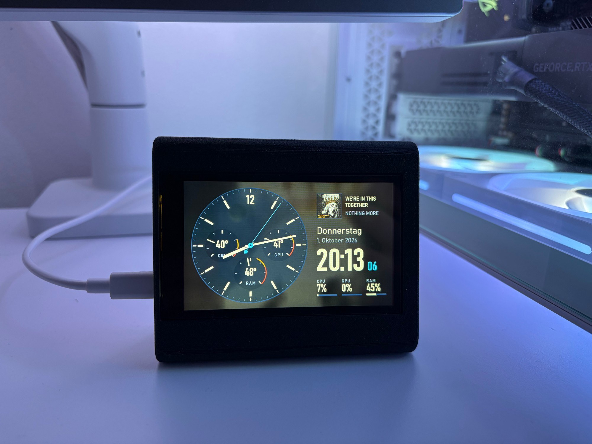
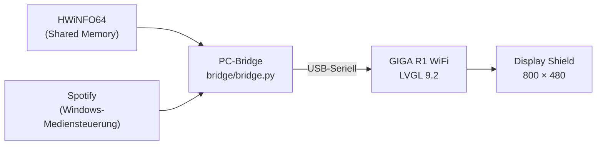
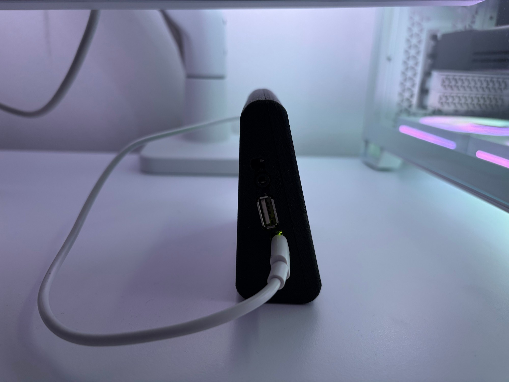

# Arduino GIGA Dashboard

Ein Schreibtisch-Instrument für den PC: Ein **Arduino GIGA R1 WiFi** mit **GIGA Display Shield** zeigt Uhrzeit,
Temperaturen und Auslastung von CPU, GPU und RAM sowie den gerade laufenden Spotify-Titel. Gestaltet ist es als
nachtblaues Chronographen-Zifferblatt in DIN-Typografie statt als Gamer-HUD.



## Funktionen

- **Analoge Uhr** mit drei Registern für die Temperaturen von CPU, GPU und RAM, mit Warn- und Heiß-Bereich
- **Digitaluhr**, Wochentag und Datum; ohne PC läuft die Uhr über die RTC des GIGA weiter
- **Auslastung** von CPU, GPU und RAM in Prozent, mit Balken
- **Spotify**: Titel, Interpret und Cover. Das Cover liegt zusätzlich unscharf und abgedunkelt im
  Hintergrund, das Zifferblatt ist halbtransparent, Wechsel werden weich übergeblendet.
  Kein Spotify-Konto und kein API-Schlüssel nötig (Windows-Mediensteuerung).
- **Selbstheilung**: Watchdog und Absturzerkennung starten den GIGA neu; den Grund schreibt die Bridge ins Log.

## Aufbau



Eine Python-Bridge auf dem PC liest die Sensoren aus HWiNFO64 und den Song aus der Windows-Mediensteuerung und
schickt alles einmal pro Sekunde per USB an den GIGA. Das Protokoll steht in [PROTOCOL.md](PROTOCOL.md).

| Ordner | Inhalt |
|---|---|
| `Dashboard/` | Arduino-Sketch (LVGL 9.2.2) |
| `bridge/` | PC-Bridge (Python), Konfiguration in `config.json` |
| `tools/` | Build- und Upload-Skript, Font-Generator |
| `docs/images/` | Fotos |

## Hardware

- [Arduino GIGA R1 WiFi](https://store.arduino.cc/products/giga-r1-wifi)
- [Arduino GIGA Display Shield](https://store.arduino.cc/products/giga-display-shield)
- USB-C-Datenkabel zum PC
- Ständer aus dem 3D-Drucker: **[Arduino GIGA Display Shield – Display Stand (MakerWorld)](https://makerworld.com/de/models/2523230-arduino-giga-dsiplay-shield-display-stand#profileId-2776105)**
- Optional: Knopfzelle am Pin `VRTC`, damit die Uhr auch stromlos weiterläuft



## Voraussetzungen

- Windows 10/11 (die Bridge nutzt HWiNFO und die Windows-Mediensteuerung)
- [Arduino IDE 2.x](https://www.arduino.cc/en/software) (enthält `arduino-cli`)
- [Python](https://www.python.org/downloads/) 3.11 oder neuer (getestet mit 3.13)
- [Node.js](https://nodejs.org/) (nur zum Erzeugen der Schriften)
- [Git](https://git-scm.com/)
- [HWiNFO64](https://www.hwinfo.com/) (die Free-Version genügt)
- Spotify-Desktop-App

## Installation

**1. Repository klonen**

```bash
git clone https://github.com/RubenBlaettel/Arduino-GIGA-Dashboard.git
cd Arduino-GIGA-Dashboard
```

**2. LVGL 9.2.2 holen.** Die Version ist fest gepinnt; neuere LVGL-Versionen passen nicht zur `lv_conf` des
Board-Pakets.

```bash
git clone --depth 1 --branch v9.2.2 https://github.com/lvgl/lvgl.git lib/lvgl
```

**3. Board-Paket installieren.** In der Arduino IDE unter *Boardverwalter* das Paket
**„Arduino Mbed OS GIGA Boards“ in Version 4.6.0** installieren.

**4. Python-Pakete installieren**

```bash
python -m pip install -r bridge/requirements.txt
python -m pip install fonttools
```

Blockiert Windows' *Smart App Control* fontTools, stattdessen `python -m pip install --no-binary fonttools fonttools`.

**5. Schriften erzeugen.** Die Oberfläche nutzt *Bahnschrift* (Microsofts DIN 1451), die in jedem Windows
enthalten ist. Die daraus erzeugten Fonts sind nicht im Repository, weil sie aus einer Microsoft-Schrift
stammen; das Skript erzeugt sie lokal.

```bash
python tools/build_fonts.py
```

**6. Firmware bauen und hochladen.** GIGA per USB anschließen. Der erste Build dauert ca. 5 Minuten.

```powershell
powershell -ExecutionPolicy Bypass -File tools\build.ps1 -Upload
```

**7. HWiNFO64 einrichten.** In den Einstellungen **„Shared Memory Support“** aktivieren, HWiNFO neu starten und das
Sensorfenster geöffnet lassen (minimiert reicht). In der Free-Version gilt Shared Memory jeweils 12 Stunden.
Alternative ohne Zeitlimit: bei den gewünschten Sensoren „Report value in Gadget“ einschalten.

**8. Bridge testen**

```bash
python bridge/bridge.py
```

Der Port wird über die USB-ID des GIGA automatisch gefunden. Das Log steht in der Konsole und in
`bridge/logs/bridge.log`.

**9. Autostart einrichten (optional).** Startet die Bridge bei jeder Anmeldung unsichtbar im Hintergrund;
`bridge\uninstall_autostart.ps1` entfernt das wieder.

```powershell
powershell -ExecutionPolicy Bypass -File bridge\install_autostart.ps1
```

**10. Ständer drucken** ([MakerWorld](https://makerworld.com/de/models/2523230-arduino-giga-dsiplay-shield-display-stand#profileId-2776105)),
GIGA mit Display Shield einsetzen, fertig.

## Konfiguration

| Datei | Einstellung |
|---|---|
| `Dashboard/config.h` | Ausrichtung des Displays (`DISPLAY_FLIPPED`), Temperatur-Skalen (min, max, warn, hot) |
| `bridge/config.json` | Serieller Port, Zuordnung der HWiNFO-Sensoren (reguläre Ausdrücke), Spotify-App, Ausblendzeit |
| `Dashboard/backdrop.cpp` | Cover-Hintergrund: Abdunklung, Sättigung, Durchsicht des Zifferblatts (`SHOW_THROUGH`) |

Nach Änderungen am Sketch erneut `tools\build.ps1 -Upload` ausführen. Das Skript pausiert die laufende Bridge
während des Uploads automatisch.

## Fehlersuche

| Anzeige / Problem | Lösung |
|---|---|
| „Keine Sensordaten …“ | In HWiNFO „Shared Memory Support“ einschalten (Free-Version: alle 12 h neu) |
| „Keine Verbindung zum PC …“ | Bridge starten; prüfen, ob ein anderes Programm den Port belegt (z. B. der Serielle Monitor) |
| Upload schlägt fehl | Laufende Bridge beenden oder am GIGA zweimal schnell Reset drücken (Bootloader) |
| Screenshot vom Display | Leere Datei `bridge/.shot` anlegen; das Bild landet in `screenshots/` |

## Hinweise

- Der Touchscreen wird nicht verwendet; das Dashboard ist eine reine Anzeige.
- [LVGL](https://github.com/lvgl/lvgl) steht unter der MIT-Lizenz. *Bahnschrift* ist eine Schrift von Microsoft;
  die daraus erzeugten Fonts sind nur für den privaten Gebrauch gedacht und werden nicht mitverteilt.

## Lizenz

[MIT](LICENSE) – gilt für den Code in diesem Repository, nicht für die lokal erzeugten Schriften.
